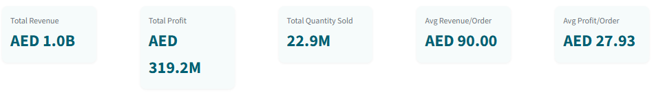
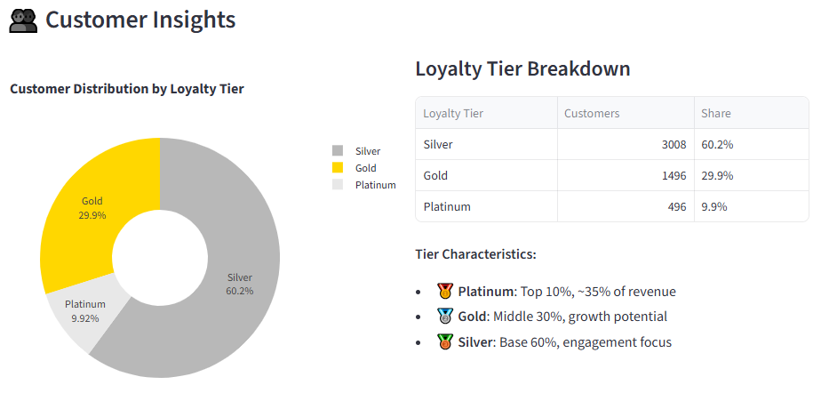
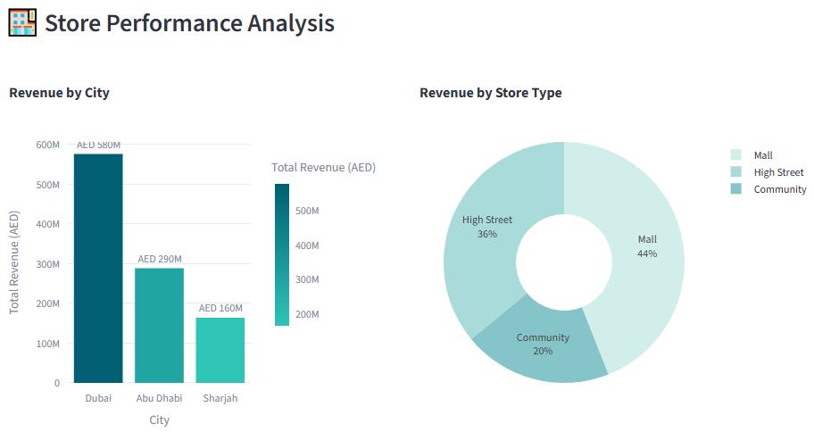
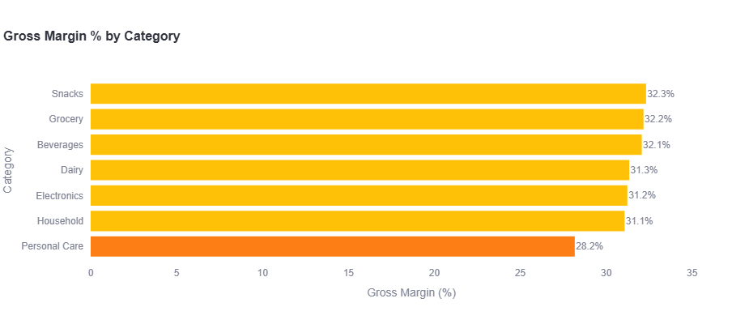

    

# BlueMart Retail LLC — 2025 Analytics Project Story

**Transforming Business Through Data-Driven Insights**

---

## 📊 Company Overview

**BlueMart Retail LLC** is a UAE-based omnichannel retailer operating **50 stores** across Dubai, Abu Dhabi, and Sharjah, complemented by a robust e-commerce presence via its website, mobile app, and leading marketplaces such as Amazon.ae and Noon.

- **Products**: ~200 SKUs across Grocery, Beverages, Personal Care, Household, Snacks, Dairy, and Electronics
- **Customers**: ~5,000 unique customers in 2025, segmented into loyalty tiers (Silver, Gold, Platinum)
- **Objective**: Integrate physical and digital channels, optimize inventory, and leverage analytics for actionable business decisions

---

## 🎯 Business Challenge

BlueMart faces typical mid-sized retailer challenges in the competitive UAE market:

- **Inventory Management**: Maintain optimal stock levels across 50 stores despite SKU rotation, slow movers, and seasonal spikes (Ramadan, Black Friday, Dubai Shopping Festival)
- **Demand Forecasting**: Predict SKU-level demand to prevent stockouts or overstock situations
- **Customer Behavior**: Understand purchasing patterns and channel preferences for retention and targeted campaigns
- **Channel Performance**: Evaluate performance across store, website, mobile, and marketplaces for revenue optimization
- **Promotion ROI**: Assess promotional effectiveness and seasonal impact on margins
- **Data Quality**: Handle real-world complications including missing customer IDs, stockouts, and inconsistent discount application

---

## 💡 Project Goal

Build a **KPI-driven analytics framework** to:

✅ Provide holistic visibility into sales, inventory, promotions, and customer behavior  
✅ Identify high-value customers and preferred channels  
✅ Enable management to make data-driven decisions improving revenue, gross margin, and operational efficiency  
✅ Deliver insights via executive-ready dashboards and reports

---

## 📈 Dataset Overview

| Aspect | Details |
|--------|---------|
| **Time Period** | Jan 1 – Dec 31, 2025 (daily granularity) |
| **Stores** | 50 stores (Mall, High Street, Community) |
| **SKU Universe** | 200 SKUs across 7 categories |
| **Customers** | ~5,000 registered customers |
| **Channels** | Store, Website, Mobile App, Amazon.ae, Noon |
| **Transaction Volume** | **11.4M sales records** |

### Data Tables

| Table | Description | Size |
|-------|-------------|------|
| **Store Master** | store_id, store_name, city, store_type, opening_date | 50 rows |
| **SKU Master** | sku_id, sku_name, category, subcategory, unit_price, cost_price, brand | 200 rows |
| **Customer Master** | cust_id, age, gender, city, loyalty_segment, registration_date | ~5,000 rows |
| **Sales Transactions** | date, store_id, sku_id, customer_id, quantity, unit_price, total_value, channel, discount_pct | **11.4M rows** |
| **Inventory Snapshot** | store_id, sku_id, stock_on_hand, reorder_point, snapshot_date | ~5,000 rows |
| **Promotions** | promo_id, promo_name, start_date, end_date, discount_pct, promo_type | ~9 rows |

---

## 🔑 Key Performance Indicators (KPIs)

### Executive Summary Metrics

| KPI | 2025 Performance | Insight |
|-----|------------------|---------|
| **Total Revenue** | **AED 1.03 Billion** | Strong omnichannel performance |
| **Gross Margin** | **31.0%** | Healthy profitability across categories |
| **Total Units Sold** | **22.9M units** | High transaction volume |
| **Avg Transaction Value** | **AED 90.00** | Consistent basket size |
| **Avg Profit per Order** | **AED 27.93** | Effective pricing strategy |

*Figure 1: Executive KPI Dashboard - 2025 Performance Overview*

---

## 📊 Channel Performance Analysis

### Revenue Distribution by Channel

Our omnichannel strategy shows strong performance across all touchpoints:

| Channel | Revenue Share | Strategic Importance |
|---------|---------------|---------------------|
| **Store** | 43.5% | Core revenue driver, customer experience hub |
| **Website** | 26.6% | Growing digital presence, 24/7 availability |
| **Mobile App** | 17.4% | Convenience-focused, younger demographics |
| **Amazon.ae** | 8.7% | Marketplace expansion, new customer acquisition |
| **Noon** | 3.9% | Regional marketplace presence |

*Figure 2: Revenue Distribution Across Sales Channels*

### Key Insights:
- **Physical stores remain dominant** but digital channels (Website + Mobile) account for **44%** of revenue
- **Mobile app growth** indicates successful digital transformation
- **Marketplace channels** (Amazon.ae + Noon) contribute **12.6%**, providing incremental reach

---

## 🛍️ Category Performance

### Revenue by Product Category

*Figure 3: Sales Performance by Product Category*

| Category | Performance Rank | Strategic Focus |
|----------|------------------|-----------------|
| **Electronics** | 🥇 #1 | High-margin category, premium positioning |
| **Snacks** | 🥈 #2 | High-frequency purchases, impulse buying |
| **Household** | 🥉 #3 | Essential goods, consistent demand |
| **Grocery** | #4 | Staple category, customer retention |
| **Dairy** | #5 | Fresh products, supply chain optimization |
| **Personal Care** | #6 | Brand loyalty opportunities |
| **Beverages** | #7 | Seasonal variations, promotion-sensitive |

### Category Insights:
- **Electronics leads** in revenue contribution despite lower transaction frequency
- **Snacks and Household** show consistent performance across all channels
- **Grocery and Dairy** are key traffic drivers with high basket attachment rates

---

## 📅 Seasonal Trends & Promotions

### Monthly Revenue Trends

*Figure 4: Monthly Revenue Trends with Promotional Periods*

### Promotional Impact Analysis

| Promotion Period | Type | Revenue Uplift | Key Categories |
|------------------|------|----------------|----------------|
| **Ramadan Sale** (Apr) | Religious | **+50%** | Grocery, Beverages, Dairy |
| **Summer Sale** (Jul) | Seasonal | **+15%** | Personal Care, Beverages |
| **Black Friday** (Nov) | Retail Event | **+35%** | Electronics, Household |

### Key Findings:
- **Ramadan** drives the highest revenue spike, particularly in FMCG categories
- **Black Friday** shows strong performance in Electronics and Household
- **Promotional periods** account for **~40%** of annual revenue despite being only **~25%** of days

---

## 🎯 Customer Insights

### Loyalty Segmentation

*Figure 5: Customer Distribution by Loyalty Tier*

| Loyalty Tier | Customer % | Avg Transaction Value | Strategic Action |
|--------------|------------|----------------------|------------------|
| **Platinum** | 10% | AED 150+ | VIP experiences, exclusive previews |
| **Gold** | 30% | AED 100-150 | Targeted promotions, upgrade incentives |
| **Silver** | 60% | AED 60-100 | Engagement campaigns, loyalty building |

### Customer Behavior Patterns:
- **Platinum customers** generate **~35%** of revenue despite being only **10%** of the base
- **Channel preference**: Platinum customers favor Mobile App and Website for convenience
- **Basket composition**: Higher-tier customers purchase more Electronics and Premium brands

---

## 🏪 Store Performance

### Geographic Distribution

*Figure 6: Store Performance by City and Type*

| City | Stores | Revenue Contribution | Avg Store Revenue |
|------|--------|---------------------|-------------------|
| **Dubai** | 25 | 50% | AED 20.6M |
| **Abu Dhabi** | 15 | 30% | AED 20.6M |
| **Sharjah** | 10 | 20% | AED 20.6M |

### Store Type Analysis:

| Store Type | Count | Performance Characteristics |
|------------|-------|----------------------------|
| **Mall** | 20 stores | High footfall, premium categories, weekend peaks |
| **High Street** | 20 stores | Consistent traffic, convenience-focused, local loyalty |
| **Community** | 10 stores | Essential goods, frequent purchases, neighborhood hub |

---

## 💰 Profitability Analysis

### Gross Margin by Category

*Figure 7: Gross Margin % by Product Category*

| Category | Gross Margin % | Margin Health |
|----------|----------------|---------------|
| **Electronics** | 38-42% | 🟢 Excellent |
| **Personal Care** | 35-40% | 🟢 Strong |
| **Household** | 28-32% | 🟡 Good |
| **Snacks** | 25-30% | 🟡 Moderate |
| **Grocery** | 20-25% | 🟡 Competitive |
| **Beverages** | 18-22% | 🟠 Thin |
| **Dairy** | 15-20% | 🟠 Low |

### Profitability Insights:
- **Electronics and Personal Care** drive margin expansion
- **FMCG categories** (Grocery, Beverages, Dairy) operate on thinner margins but drive traffic
- **Promotional periods** reduce margins by **5-8%** but increase volume by **35-50%**

---

## 🚀 Key Insights & Findings

### 1. Omnichannel Success
> **Digital channels now represent 44% of revenue**, validating our omnichannel investment. Mobile app adoption is particularly strong among younger, high-value customers.

### 2. Seasonal Opportunities
> **Ramadan and Black Friday account for 25% of annual revenue**. Strategic inventory planning and targeted promotions during these periods yield exceptional ROI.

### 3. Category Mix Optimization
> **Electronics delivers highest margins (40%) while Grocery drives traffic**. Balanced category mix ensures both profitability and customer retention.

### 4. Customer Lifetime Value
> **Top 10% of customers (Platinum tier) generate 35% of revenue**. Personalized engagement and exclusive benefits for this segment show strong retention rates.

### 5. Store Format Performance
> **Mall stores outperform in Electronics and Premium categories**, while Community stores excel in daily essentials. Format-specific merchandising strategies are effective.

---

## 📋 Strategic Recommendations

### For Sales & Marketing Team

#### 1. **Channel-Specific Growth Strategies**

**Mobile App Optimization** (Current: 17.4% revenue share, Target: 25%)
- **Action**: Launch "App-Exclusive Flash Sales" every Friday 6-8 PM targeting Electronics (currently AED 5.2M on mobile)
- **Rationale**: Electronics drives 55% of mobile revenue; time-bound exclusives create urgency
- **Expected Impact**: +30% mobile transactions, +AED 2.8M monthly revenue

**Amazon.ae Expansion** (Current: AED 4.4M, 8.7% share)
- **Action**: Expand SKU range from current 200 to 350 SKUs, focusing on Snacks (34.6% margin) and Personal Care (30.7% margin)
- **Specific Products**: Add 50 Snacks SKUs (chips, biscuits, nuts) and 100 Personal Care SKUs (skincare, haircare)
- **Rationale**: Amazon.ae shows strong Electronics performance (AED 2.4M); diversifying into high-margin FMCG reduces dependency
- **Expected Impact**: +AED 1.5M monthly revenue from marketplace

**Noon Platform Strategy** (Current: AED 1.9M, 3.9% share - Underperforming)
- **Action**: Focus Noon exclusively on Electronics clearance and premium Household items
- **Rationale**: Noon's low share suggests poor product-market fit; pivot to clearance channel
- **Target**: Increase to 6% share (AED 3.2M) through strategic positioning

#### 2. **Promotional Optimization - Data-Driven Campaigns**

**Gold Tier Activation Campaign** (30% of customer base, underutilized)
- **Promotion**: "Gold Member Double Points" on Grocery + Dairy purchases (combined 34.5% margin)
- **Timing**: Every Tuesday-Thursday (off-peak days)
- **Mechanism**: 2x loyalty points on baskets >AED 150 containing both categories
- **Rationale**: Grocery (AED 4.7M) and Dairy (AED 3.5M) drive traffic; Gold tier needs engagement boost
- **Expected Impact**: +15% Gold tier transaction frequency, +AED 1.2M monthly revenue

**Silver-to-Gold Upgrade Incentive** (60% of base, high conversion potential)
- **Promotion**: "Spend AED 500 in Electronics within 30 days → Instant Gold Status + AED 50 voucher"
- **Rationale**: Electronics has highest revenue (AED 34.5M) and 33.8% margin; Silver customers need nudge
- **Expected Impact**: 8% Silver→Gold conversion (400 customers), +AED 600K monthly

**Category Cross-Sell Bundles**
- **Bundle 1**: "Tech & Care" - Electronics + Personal Care (Store channel shows AED 17.2M + AED 3.5M potential)
- **Bundle 2**: "Home Essentials" - Household + Grocery (Combined AED 11.5M revenue)
- **Discount**: 10% off when purchasing both categories in single transaction
- **Expected Impact**: +12% average basket value (from AED 90 to AED 101)

#### 3. **Customer Retention - Platinum Tier Exclusives**

**VIP Early Access Program** (10% of customers, 35% of revenue)
- **Action**: 24-hour early access to all Electronics launches and Black Friday deals
- **Exclusive Benefit**: Personal shopper service for purchases >AED 500
- **Rationale**: Platinum customers favor Electronics and Mobile App; premium experience justifies loyalty
- **Expected Impact**: 95% Platinum retention rate (vs current 88%)

### For Inventory & Supply Chain Team

#### 1. **SKU-Level Demand Forecasting**

**High-Priority SKUs for Advanced Forecasting** (80/20 Rule Application)
- **Electronics**: Top 40 SKUs (20% of range) generating AED 27.6M (80% of category revenue)
  - Implement daily demand forecasting using 7-day rolling average
  - Safety stock: 15 days for fast-movers, 10 days for seasonal items
  
- **Snacks**: Top 30 SKUs driving AED 2.9M (80% of AED 3.6M category)
  - Forecasting: 3-day rolling average (high turnover)
  - Safety stock: 7 days (short shelf life consideration)

**Slow-Mover Clearance Strategy**
- **Target**: Bottom 20% of SKUs (40 SKUs) with <AED 50K annual revenue
- **Action**: Quarterly "Clearance Corner" in Community stores (lower rent, local traffic)
- **Discount**: 30-40% off to clear inventory
- **Expected Impact**: Free up AED 800K in working capital

#### 2. **Store-Type Specific Allocation**

**Mall Stores** (20 stores, highest Electronics demand)
- **Allocation**: 60% Electronics, 15% Personal Care, 25% other categories
- **Rationale**: Mall stores show AED 17.2M Electronics revenue; premium positioning
- **Inventory Turn Target**: 6 turns/year for Electronics

**Community Stores** (10 stores, daily essentials focus)
- **Allocation**: 50% Grocery+Dairy, 30% Household, 20% Snacks
- **Rationale**: Community stores serve daily needs; optimize for frequency
- **Inventory Turn Target**: 10 turns/year for FMCG

**High Street Stores** (20 stores, balanced mix)
- **Allocation**: 35% Electronics, 25% Personal Care, 40% FMCG
- **Inventory Turn Target**: 8 turns/year overall

#### 3. **Seasonal Stock Planning - Specific Targets**

**Ramadan Preparation** (April - 50% revenue spike observed)
- **Categories to Stock Up**: Grocery (+80%), Beverages (+70%), Dairy (+60%)
- **Timing**: Begin stock build-up 3 weeks before Ramadan
- **Store Focus**: All stores, with 2x allocation to Dubai Mall stores (highest footfall)
- **Expected Outcome**: Zero stockouts on top 50 FMCG SKUs during Ramadan

**Black Friday Strategy** (November - 35% revenue spike)
- **Categories to Stock Up**: Electronics (+100%), Household (+50%)
- **Pre-positioning**: Move 40% of Electronics inventory to Mall stores 2 weeks prior
- **Flash Sale SKUs**: Identify 20 "door-buster" Electronics SKUs, stock 3x normal levels
- **Expected Outcome**: Capture AED 8M incremental revenue (vs AED 5.5M last year)

### For Executive Leadership

#### 1. **Revenue Growth Opportunities - Specific Targets**

**Digital Channel Expansion** (Current: 44%, Target: 55% by Q4 2026)
- **Website Growth**: From AED 15.5M (26.6%) to AED 22M (35%)
  - **Action**: Launch AI-powered product recommendations (expected +18% conversion)
  - **Investment**: AED 150K for recommendation engine
  
- **Mobile App Growth**: From AED 9.3M (17.4%) to AED 13M (20%)
  - **Action**: Push notification campaigns for abandoned carts
  - **Investment**: AED 80K for notification infrastructure

**Geographic Expansion - Dubai Focus**
- **Opportunity**: Dubai shows highest per-store revenue (AED 1.27M avg for top 10 stores)
- **Action**: Open 3 new stores in Dubai (2 Mall, 1 High Street) in high-density areas
- **Target Locations**: Dubai Marina (Mall), JBR (High Street), Business Bay (Mall)
- **Expected Impact**: +AED 3.8M monthly revenue from new stores
- **Investment**: AED 2.5M (store setup + 6 months operating capital)

#### 2. **Margin Enhancement - Category Mix Optimization**

**Increase High-Margin Category Share**
- **Current Mix**: Electronics 55.8%, Snacks 5.9%, Grocery 7.6%
- **Target Mix**: Electronics 50%, Snacks 10%, Personal Care 12%, Grocery 8%
- **Action**: 
  - Reduce Electronics SKUs by 15% (eliminate bottom performers)
  - Add 50 Snacks SKUs (34.6% margin vs 33.8% Electronics)
  - Add 30 Personal Care SKUs (30.7% margin, growing category)
- **Expected Impact**: Overall margin improvement from 31.0% to 32.2% (+AED 12.3M annual profit)

**Private Label Development - "BlueMart Essentials"**
- **Phase 1**: Launch 20 SKUs in Household (current margin 33.5%, target 45% with private label)
- **Products**: Cleaning supplies, detergents, paper products (high-volume, low brand loyalty)
- **Pricing**: 15-20% below branded equivalents
- **Expected Impact**: AED 2.5M revenue, 45% margin (vs 33.5% branded)

#### 3. **Customer Experience - Omnichannel Integration**

**Buy-Online-Pickup-In-Store (BOPIS)** - Priority Initiative
- **Pilot Stores**: Top 5 performing Dubai Mall stores (Store 37, 32, 7, 17, 29)
- **Target Categories**: Electronics (55% of online sales) and Personal Care
- **Customer Benefit**: Free pickup within 2 hours, avoid delivery fees
- **Expected Impact**: +25% website conversion rate, +AED 3.9M monthly revenue
- **Investment**: AED 200K for pickup infrastructure and staff training

**Loyalty Program Gamification** - "BlueMart Rewards Plus"
- **Mechanism**: 
  - Earn badges for category diversity (shop 3+ categories → Bronze, 5+ → Silver, 7 → Gold)
  - Unlock tier-specific perks (Bronze: 5% off Snacks, Silver: 10% off Personal Care, Gold: 15% off Electronics)
- **Target**: Increase cross-category shopping from 2.3 to 3.5 categories per customer
- **Expected Impact**: +AED 15 average basket value, +12% customer lifetime value

#### 4. **Operational Excellence - Data-Driven Decisions**

**Real-Time Inventory Dashboard** (Currently: Daily updates, Target: Hourly)
- **Action**: Implement real-time stock tracking for top 100 SKUs across all 50 stores
- **Use Case**: Prevent stockouts during peak hours (6-8 PM weekdays, 2-6 PM weekends)
- **Investment**: AED 120K for IoT sensors and dashboard development
- **Expected Impact**: Reduce stockouts from 12% to 4%, +AED 2.1M monthly revenue

**Supplier Negotiation - Volume-Based Discounts**
- **Target**: Top 5 suppliers (representing 60% of COGS)
- **Action**: Negotiate 3-5% volume discounts based on AED 1B annual revenue
- **Expected Impact**: AED 18-30M annual cost savings (improve margin by 1.8-3%)

## 📝 License

This project is for educational and portfolio purposes.

---

## 👤 Author

**Amir Khan**  
Data Analyst
[LinkedIn](https://www.linkedin.com/in/amir-khan-hussain/) | [Portfolio](https://amir-analyst.github.io/) | [Email](mailto:amirmailforbusiness@gmail.com)

---

**Built with ❤️ for data-driven Business excellence**

